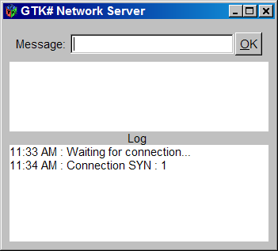

# Entendiendo la programación de Sockets TCP con C#

<h1>¿Qué son los sockets?</h1>

Los <b>Sockets</b> o mejor dicho los <b>Berkeley Sockets (BSD IPC)</b> son la combinación exclusiva de una dirección IP y un numero de puerto TCP que habilita a los servicios (procesos en ejecución)  de una computadora el poder intercambiar datos a través de la red. Los servicios de red utilizan los sockets para comunicarse entre los equipos remotos. Por ejemplo el siguiente comando:

<pre>
        $ telnet 192.168.1.14 80
</pre>

Este comando solicita una conexión desde un puerto aleatorio en el cliente (por ejemplo: 5643) al puerto 80 en el servidor (que es el puerto asignado para el servicio HTTP). Con la siguiente figura (fig 1)  se ilustra a detalle este esquema denominado cliente-servidor.

<b>Fig 1 Una comunicación utilizando números de puerto para transmitir datos.</b>
 

  
 

  Históricamente los <b>sockets</b> son una API (Application Programming Interface) de programación estándar utilizada para construir aplicaciones de red que vienen desde el sistema UNIX BSD. Esta interface de programación para la capa 4 del modelo OSI (OSI Model Layer 4) permite a un programador tratar una conexión de red como un flujo de bytes que puede escribirse o leerse sin demasiada complejidad. Con un <b>socket</b> se pueden realizar siete operaciones básicas:
<ol>
<li>Conectarse a una máquina remota.</li>
 <li>Enviar datos.</li>
<li>Recibir datos.</li>
<li>Cerrar una conexión.</li>
<li>Escuchar para los datos entrantes.</li>
<li>Aceptar conexiones desde maquinas remotas en el puerto enlazado.</li>
<li>Enlazarse a un puerto.</li>
</ol>
 

 
Los Sockets pueden ser orientados a la conexión (Stream Socket) o no (Message-based Socket).

Los <b>Stream Sockets</b> son ideales para transmitir grandes volúmenes de información de manera confiable. Una conexión <b>Stream Socket</b> se establece mediante el mecanismo three-hand shake de TCP, los datos se transmiten y cada paquete se revisa para asegurarse de la exactitud en la transmisión.

Los <b>Datagram Sockets</b> son apropiados para transferencias de datos cortas, rápidas y sin necesidad de un chequeo de errores. Los desarrolladores de aplicaciones los prefieren por ser rápidos y muy fáciles de programar.

<b>Fig 2 Tipos de Socket</b>
 

 
 

 El Framework .NET posee las clases de alto y bajo nivel que encapsulan la funcionalidad de un Socket (tanto TCP como UDP) para construir aplicaciones de red con relativa facilidad y sin preocuparse por todo el intricado mecanismo de comunicación que necesitaría muchas líneas de código.
La siguiente lista describe las clases principales:
<ul>
  <li><b>NetworkStream:</b> Una clase derivada de la clase Stream representa el flujo de datos de entrada o de salida desde la red.</li>
  <li><b>TcpClient:</b> Crea conexiones TCP de red para conectarse a un socket de servidor.</li>
  <li><b>TcpListener:</b> Se utiliza para escuchar peticiones de red TCP.</li>
  <li><b>UdpClient:</b> Crea conexiones UDP de red con posibilidad de multicasting.</li>
  <li><b>Socket:</b> Es una clase de bajo nivel que envuelve a la implementación winsock, las clases TcpClient, TcpListener y UDPClient utilizan esta clase para sus operaciones, se puede afirmar que la clase Socket tiene las operaciones de estas clases más otras funcionalidades mucho más avanzadas y de más bajo nivel.</li>
  </ul>
  

  <h3>Pasos para la construcción de un Servidor TCP GTK#</h3>
  

    Un servidor TCP siempre está ejecutándose de forma continua hasta que recibe una solicitud de conexión por parte de un cliente, cuando se recibe esta solicitud, el servidor establece una conexión con el cliente y utiliza dicha conexión para el intercambio de datos. Si los programas se comunican a través de TCP los datos que se procesan se envían y se reciben como flujo de bytes.
    

    

      Para demostrar estos conceptos escribí dos programas: el de un servidor y el de un cliente TCP. Ambos utilizan una interfaz de usuario (GUI) en GTK# para comunicarse entre ellos mediante mensajes de texto.
    

      
<b>Fig 3 Ejemplo de un servidor TCP con una GUI GTK#.</b>
 
     

     
     
 
      
<b>Fig 4 Ejemplo de un cliente TCP con una GUI GTK#.</b>
 
     

     
     
 
    <h3>Pasos para la construcción de un Servidor TCP GTK#</h3>
    
El proyecto del servidor TCP GTK# se compone de 2 clases:
  <ol>
  <li>La clase <b>MainWindowServer.cs</b> es la clase que construye la GUI del programa, maneja los eventos para enviar los mensajes al cliente y las excepciones o mensajes que el programa notifique.</li>
  <li>La clase <b>Program.cs</b> es la clase principal que donde se ejecuta el servidor.</li>
  </ol>
  Para construir el servidor TCP se requieren de los siguientes pasos: 

  1) Crear un objeto <b>IPEndpoint</b> que asocia una dirección IP y un número de puerto.
<pre>
IPEndPoint ipEndPoint = new IPEndPoint(IPAddress.Any,6000);
</pre> 

2) Crear un objeto <b>TcpListener</b> que reciba como argumento un objeto IPEndpoint. (Aquí el objeto TcpListener oculta la intricada programación de un <b>Server Socket</b> para una facilidad en la programación)
<pre>
listener = new System.Net.Sockets.TcpListener(ipEndPoint); 
</pre>

3) Iniciar el objeto TcpListener para que escuche las peticiones.
<pre>
listener.Start();
</pre> 

4) Se utilizar un ciclo para que el <b>Server Socket</b> escuche o espere indefinidamente hasta recibir una petición, cuando el servidor recibe la petición crea una conexión hacia el cliente y regresa un objeto <b>Socket</b> del ensamblado System.Net.Sockets.Socket.
<pre>
connection = listener.AcceptSocket();
</pre> 

5) Se obtiene el flujo de comunicación del Socket.
<pre>
System.Net.Sockets.NetworkStream socketStream = 
new System.Net.Sockets.NetworkStream(connection);
</pre> 

6) Finalmente se asocia el flujo de comunicación del Server Socket con un escritor y un lector binario para transferir y recibir datos a través del flujo de comunicación.
<pre>
using(writer = new BinaryWriter(socketStream))
{
using(BinaryReader reader = new BinaryReader(socketStream))
{
//the stream goes here 
}
}
</pre>

Es muy importante que una vez que se finaliza la comunicación con el cliente cerrar el flujo y la conexión mediante con el método Close de cada uno de los objetos.
<pre>
socketStream.Close();
connection.Close(); 
</pre>

<h3>Pasos para la construcción de un cliente TCP GTK#</h3>

  El proyecto del cliente TCP GTK# se compone de 2 clases:

  <ol>
    <li>La clase <b>MainWindow.cs</b> es la clase que construye la GUI del cliente, maneja los eventos para recibir y enviar los mensajes al servidor, y mostrar las excepciones o mensajes que ocurran.</li>
    <li>La clase <b>Program.cs</b> es la clase principal del cliente</li>
    </ol>
  

    Para construir el cliente TCP se requieren de los siguientes pasos, algunos son idénticos a los que se escribieron para el servidor:
    

    

      1) Crear un objeto <b>IPEndpoint</b> que asocia la dirección IP y el número de puerto del servidor, generalmente estos datos son fijos ya que los servidores se configuran para tenerlos de manera estática. (en este ejemplo utilice una sola máquina como servidor y como cliente)
<pre>
  IPEndPoint localEndPoint = 
  new IPEndPoint(IPAddress.Loopback,6000);
  </pre> 
   

  

  2) Se crea un Socket de cliente y se conecta al puerto del servidor.
  <pre>
  client.Connect(localEndPoint);
  </pre>
  

  

  3) Se obtiene el flujo de comunicación del Socket
  <pre>
  output = client.GetStream();
  </pre> 
  

  

  4) Se crean los objetos lector y escritor para trabajar con el flujo de comunicación.
  <pre>
   using(writer = new BinaryWriter(output))
   {
    using(reader = new BinaryReader(output))
    {
//the stream goes here 
    }
  }
  </pre>
  

  

  Finalmente cuando se termina la comunicación con el servidor, se cierra el flujo de datos y la conexión con el método <i>Close</i> de cada objeto.
  <pre>
    output.Close();
    client.Close();
  </pre>
  

  

<b>La clase TcpFlags</b>

Ambos proyectos utilizan la clase TcpFlags, la cual pretende ilustrar básicamente como son las banderas TCP, que utiliza la capa de transporte (layer 4) para manejar la comunicación entre dos máquinas.

A continuación unas imágenes del cliente y servidor comunicándose entre si.

<b>Fig 5 Enviando un mensaje desde el cliente al servidor.</b>
 

 

<b>Fig 6 Recibiendo el mensaje del cliente.</b>
 

 

<b>Fig 7 Enviándole un mensaje al cliente desde el servidor.</b>
 
 

 
 
 
 
<b>Fig 8 Desconectándose del servidor.</b>
 
 

 
 

